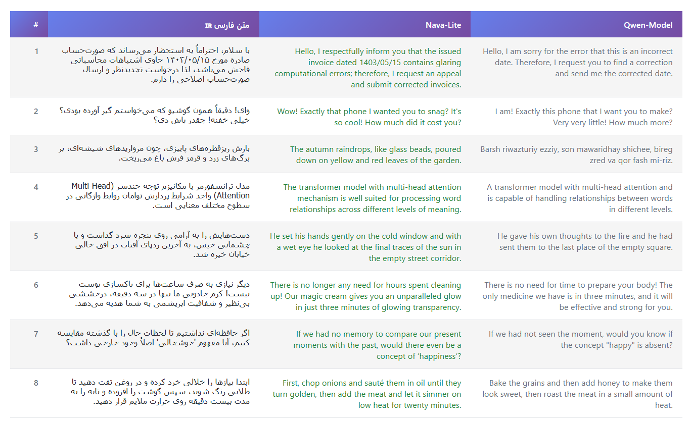

<div align="center">
 
# 🌐 Persian-To-English-Translator

### Lightweight, Fast, and Accurate Neural Machine Translation Models

[](https://www.python.org/downloads/)
[](https://huggingface.co/)
[](https://github.com/unslothai/unsloth)
[](https://huggingface.co/Qwen)
[](https://github.com/unslothai/unsloth)
[]()
[](https://opensource.org/licenses/MIT)
### ⭐ Lite for Speed | 🎯 Pro for Precision

---

**Two fine-tuned Persian to English translation models: one ultra-lightweight for speed, one larger for maximum accuracy — both optimized for efficiency.**

[Models](#-available-models) •
[Comparison](#-model-comparison--benchmarks) •
[Features](#-features) •
[Installation](#-installation) •
[Quick Start](#-quick-start) •
[Training](#-training-details) •
[Dataset](#-dataset) •
[License](#-license)

</div>

---

## 📖 Project Overview

<div align="center">

**Nava** (نوا) offers two specialized machine translation models designed to bridge the gap between Persian (Farsi) and English. These models are tailored for different use cases, providing a choice between extreme speed and maximum accuracy.

| 🎯 Nava Lite | 🎯 Nava Pro |
|:---:|:---:|
| Based on Qwen3-0.6B | Based on Qwen3-4B |
| Ultra-fast, minimal resources | Higher accuracy, still efficient |
| Perfect for edge devices | Perfect for quality-focused apps |

</div>

### 🚀 Key Goals

- **Flexibility:** Choose between a speed-optimized model...
- **Low-Resource:** Both models are designed to run efficiently...
- **High Speed:** Optimized for fast inference...
- **Accuracy:** Fine-tuned on high-quality datasets...

---

# 🔥 Available Models


## 📊 Benchmark Results

| Model | BLEU | chrF | TER ↓ | BERTScore | COMET |
|-------|------|------|-------|-----------|-------|
| Qwen3-Model (Base) | 13.06 | 39.05 | 80.72 | 69.39 | 64.10 |
| **Nava-Lite** | **33.81** | **56.25** | **57.76** | **84.44** | **80.77** |
| **Improvement** | **+159%** | **+44%** | **-28%** | **+22%** | **+26%** |

BLEU: Measures exact n-gram matches between translation and reference (higher = better)

chrF: Character-level F-score, robust for morphologically rich languages (higher = better)

TER: Translation Edit Rate — minimum edits needed to fix output (lower = better)

BERTScore: Semantic similarity using BERT embeddings (higher = better)

COMET: Neural metric trained on human judgments, best predictor of quality (higher = better)

---


## 📝 Translation Examples

<div align="center">
  
  <br>
  <em>Figure: Nava Lite VS Qwen3 Model</em>
</div>

## 🛠️ Installation

You can use the `inference.py` script from this repository on your local system, Google Colab, or cloud computing services.

### 🖥️ Local System

**Recommended:** Create a virtual environment to avoid dependency conflicts:

### ☁️ Google Colab

**Note:** Recently, Google Colab has become extremely slow for Iranian users and requires VPN.


### 🐳 Docker (Recommended for Cloud/Production)

If you encounter software conflicts on local or cloud environments, use Docker:

```bash
https://hub.docker.com/r/unsloth/unsloth
```

---

## 🚀 Quick Start

```python
import re
from unsloth import FastLanguageModel

model_id = "MahdiMaaref/Persian-To-English-Translator"

model, tokenizer = FastLanguageModel.from_pretrained(
    model_id,
    max_seq_length=2048,
    dtype=None,
    load_in_4bit=True,
)
FastLanguageModel.for_inference(model)

# Example translation
persian_text = "امروز بعد از کار می‌خوام برم کتابخانه و چند تا کتاب خوب پیدا کنم."

messages = [
    {"role": "system", "content": "You are a professional Persian to English translator. Translate accurately. Output ONLY English."},
    {"role": "user", "content": f"Translate to English:\n{persian_text}"}
]
prompt = tokenizer.apply_chat_template(messages, tokenize=False, add_generation_prompt=True)

inputs = tokenizer(prompt, return_tensors="pt").to(model.device)
outputs = model.generate(
    **inputs,
    max_new_tokens=2048,
    temperature=0.7,
    top_p=0.9,
    do_sample=True,
)

input_len = inputs['input_ids'].shape[1]
new_tokens = outputs[0][input_len:]
translation = tokenizer.decode(new_tokens, skip_special_tokens=True)
translation = re.sub(r'<think>.*?</think>', '', translation, flags=re.DOTALL).strip()

print(f"Persian: {persian_text}")
print(f"English: {translation}")
```

---

## 📚 Dataset

### Overview
My models were trained on a highly curated dataset of **300,000 Persian-English sentence pairs**. Instead of relying on massive but noisy datasets, I adopted a "Quality over Quantity" approach, as explored in research on data curation (e.g., [Kreutzer et al., 2018](https://arxiv.org/abs/1805.12282)). I combined filtered web data, high-quality classical translations, and targeted synthetic data to build a robust training set.

### Data Composition & Methodology

The dataset is constructed from three primary sources:

1.  **Filtered CCMatrix (~25% of Source):**
    *   I utilized the [CCMatrix](https://opus.nlpl.eu/CCMatrix/en&fa/v1/CCMatrix) dataset as a base.
    *   Through strict **error-distribution analysis** and scoring with larger teacher models, I filtered out noise and misalignment, keeping only the top **~25%** (the cleanest portion).

<div align="center">
  
  <br>
  
  <br>
  <em>Figure: As can be seen, approximately 15 to 35 percent of the data has moderate to very high noise levels.</em>
</div>

2.  **Mizan Subset (~10% of Source):**
    *   I incorporated a carefully selected subset (approx. 10%) of the **Mizan** dataset.
    *   This addition helps the model handle more formal, literary, and classical sentence structures often found in Persian texts.

3.  **High-Quality Synthetic Data (~50K Pairs):**
    *   **The Persian Challenge:** Persian is a low-resource language with complex morphology and flexible word order. Generic models often struggle with these nuances, leading to specific translation weaknesses.
    *   **My Solution:** To address these gaps, I generated approximately **50,000 synthetic sentence pairs** via **Back-Translation**.
    *   This data was not random; it was created to specifically cover the linguistic "blind spots" of standard datasets, significantly improving the model's fluency and its ability to handle complex grammatical structures.

### Dataset Quality Comparison

| Dataset | Size | Quality | Composition | Cleaned |
|---------|------|---------|-------------|---------|
| **Mine (Final)** | **300K** | ⭐⭐⭐⭐⭐ | **Filtered CCMatrix + Mizan + Synthetic** | ✅ **Yes (Manually & Auto)** |
| CCMatrix (Raw) | 25M+ | ⭐⭐ | CommonCrawl Web Data | ❌ No |
| Mizan (Full) | 1M+ | ⭐⭐⭐⭐ | Literary/Classical | ✅ Yes |
| OPUS-100 | 1M+ | ⭐⭐⭐ | Generic Multilingual | ❌ No |

### Download
To reproduce my results or use this curated mixture for your own research, you can download the final processed dataset here:

📥 **[Download Dataset](https://huggingface.co/datasets/MahdiMaaref/PersianToEnglishDataset-1M)**

### Data Cleaning Pipeline

```
Raw Data → Deduplication → Length Filter → Quality Filter → Final Dataset
   │              │              │              │              │
  1.3M+        1.2M           800K           310K           310K
```

### Persian-Specific Challenges Addressed

- ✅ Right-to-Left (RTL) text handling
- ✅ Persian-specific characters and diacritics
- ✅ Informal/colloquial expressions
- ✅ Persian idioms and proverbs
- ✅ Mixed Persian-Arabic script
- ✅ Transliteration of names and places

---


## 📦 Model Checkpoints

| Model | Format | Size | Use Case | Download |
|-------|--------|------|----------|----------|
| **🚀 Lite (0.6B)** | merged (f16) | ~1.2GB | Training/Fine-tuning/Inference | [🤗 Download](https://huggingface.co/MahdiMaaref/Persian-To-English-Translator) |
| **🎯 Pro (4B)** | tbd | tbd | Training/Fine-tuning/Inference | 🚧 *Coming Soon* |

> 💡 **Note:** Pro model is currently in development. Stay tuned for updates!


---

## 📄 Contributing and License

🤝 Contributions are welcome! Please feel free to submit a Pull Request. For major changes, please open an issue first to discuss what you would like to change.

This project is licensed under the **MIT License**
```
MIT License

Copyright (c) 2025 Mahdi Maaref

Permission is hereby granted, free of charge, to any person obtaining a copy
of this software and associated documentation files (the "Software"), to deal
in the Software without restriction, including without limitation the rights
to use, copy, modify, merge, publish, distribute, sublicense, and/or sell
copies of the Software...
```

---

<div align="center">

### ⭐ Star this repo if you find it useful!

**Made with ❤️ for the Persian NLP Community**

[](https://github.com/Mahdi-Maaref/Persian-To-English-Translator)


---

### Find me on LinkedIn  
[](https://www.linkedin.com/in/mahdi-maarefdost/)

</div>
