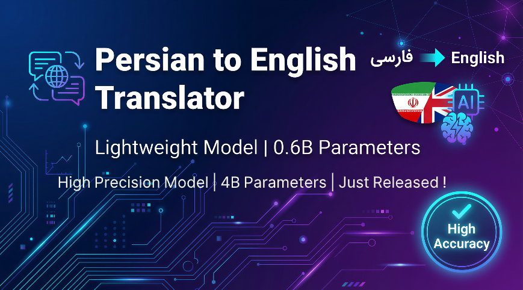
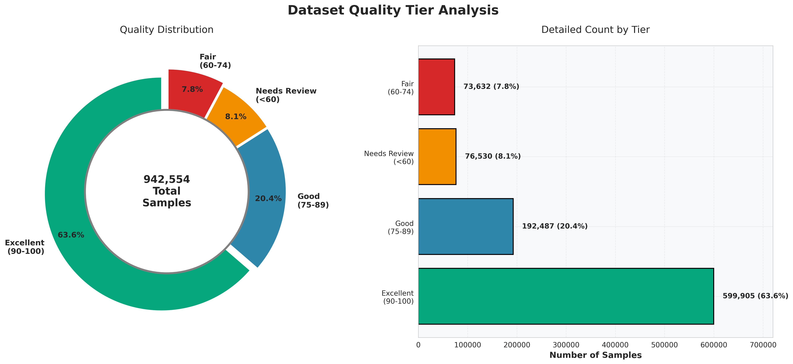
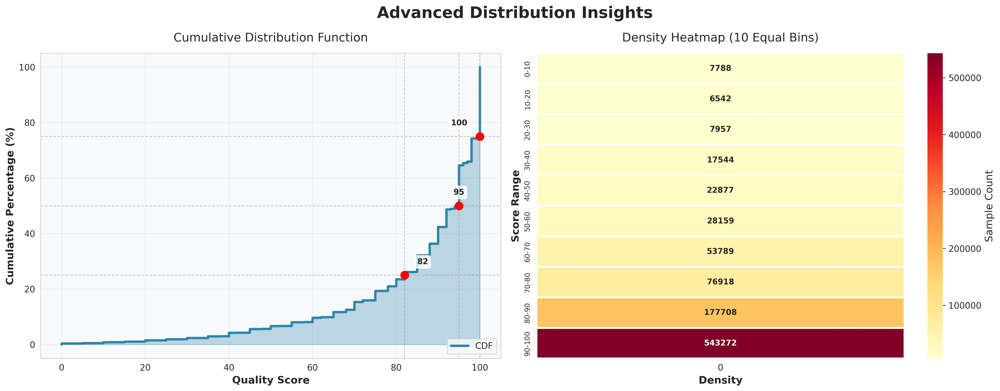

<div align="center">
 
# 🌐 Persian-To-English-Translator

### Lightweight, Fast, and Accurate Neural Machine Translation Models

[](https://www.python.org/downloads/)
[](https://huggingface.co/)
[](https://github.com/unslothai/unsloth)
[](https://huggingface.co/Qwen)
[](https://github.com/unslothai/unsloth)
[]()
[](https://opensource.org/licenses/MIT)

---

**Two fine-tuned Persian to English translation models: one ultra-lightweight for speed, one larger for maximum accuracy — both optimized for efficiency.**

[Models](#-available-models) •
[Comparison](#-model-comparison--benchmarks) •
[Features](#-features) •
[Installation](#-installation) •
[Quick Start](#-quick-start) •
[Training](#-training-details) •
[Dataset](#-dataset) •
[License](#-license)

</div>

---

<details>
<summary><h2>📖 Project Overview</h2></summary>

<div align="center">

**Nava** (نوا) offers two specialized machine translation models designed to bridge the gap between Persian (Farsi) and English. These models are tailored for different use cases, providing a choice between extreme speed and maximum accuracy.

| 🎯 Nava Lite | 🎯 Nava Pro |
|:---:|:---:|
| Based on Qwen3-0.6B | Based on Qwen3-4B |
| Ultra-fast, minimal resources | Higher accuracy, still efficient |
| Perfect for edge devices | Perfect for quality-focused apps |

</div>

### 🚀 Key Goals

- **Flexibility:** Choose between a speed-optimized model...
- **Low-Resource:** Both models are designed to run efficiently...
- **High Speed:** Optimized for fast inference...
- **Accuracy:** Fine-tuned on high-quality datasets...

</details>

---

<details>
<summary><h2>🔥 Available Models</h2></summary>

### Model Specifications

| Feature | 🎯 **Nava Lite (0.6B)** | 🎯 **Nava Pro (4B)** |
|---------|:---:|:---:|
| **Base Model** | Qwen3-0.6B | Qwen3-4B |
| **Total Parameters** | 616M | ~4B |
| **Trainable Params** | 20.2M (3.28%) | TBD |
| **Model Size (FP16)** | ~1.2GB | ~8GB |
| **GGUF Q4_K_M Size** | ~400MB | ~2.5GB |
| **Inference Speed** | ⚡⚡⚡⚡⚡ | ⚡⚡⚡ |
| **Translation Quality** | ⭐⭐⭐⭐ | ⭐⭐⭐⭐⭐ |
| **RAM Required** | ~2GB | ~6GB |
| **GPU Required** | Optional | Recommended |
| **Best For** | Mobile, Edge, Real-time | Desktop, Server, Quality |

### 🎯 Lite Model (0.6B) — Speed Champion
```
Perfect for: Mobile apps, IoT devices, real-time translation, 
             low-power devices, batch processing at scale
```

### 🎯 Pro Model (4B) — Accuracy Champion
```
Perfect for: Professional translation, content creation, 
             complex sentences, idiomatic expressions, nuanced text
```

> 💡 **Note:** Even our "Pro" 4B model is remarkably lightweight compared to industry giants like GPT-4 (1.7T params) or LLaMA-70B. It's like comparing a feather to an elephant!

</details>

---

<details>
<summary><h2>📊 Model Comparison & Benchmarks</h2></summary>

### 🏆 Performance Comparison: Fine-tuned vs Base Models vs Google Translate

<details>
<summary><h4>📈 Quantitative Metrics</h4></summary>

| Model | BLEU ↑ | chrF ↑ | COMET ↑ | Tokens/sec (GPU) ↑ | Tokens/sec (CPU) ↑ |
|:------|:------:|:------:|:-------:|:------------------:|:------------------:|
| **🪶 Lite (Fine-tuned)** | TBD | TBD | TBD | TBD | TBD |
| Qwen3-0.6B (Base) | TBD | TBD | TBD | TBD | TBD |
| **🎯 Pro (Fine-tuned)** | TBD | TBD | TBD | TBD | TBD |
| Qwen3-4B (Base) | TBD | TBD | TBD | TBD | TBD |
| Google Translate | TBD | TBD | TBD | N/A | N/A |

> 🚧 **Note:** Comprehensive benchmarks are in progress. Results will be updated soon.

</details>

<details>
<summary><h4>📊 Improvement Over Base Models</h4></summary>

| Comparison | BLEU Improvement | chrF Improvement | Notes |
|:-----------|:----------------:|:----------------:|:------|
| 🪶 Lite vs Qwen3-0.6B Base | +TBD% | +TBD% | Specialized for FA→EN |
| 🎯 Pro vs Qwen3-4B Base | +TBD% | +TBD% | Higher baseline, more gains |
| 🪶 Lite vs Google Translate | TBD | TBD | Offline capable! |
| 🎯 Pro vs Google Translate | TBD | TBD | Privacy-preserving! |

</details>

<details>
<summary><h4>📝 Qualitative Comparison</h4></summary>

| Challenge Type | Source (Persian) | Qwen-0.6B (Base) | Google Translate | Ours (Fine-tuned) |
| :--- | :--- | :--- | :--- | :--- |
| **Simple** | سلام، حال شما چطور است؟ | TBD | Hello, how are you? | Hello, how are you? |
| **Idiomatic** | از کوزه همان برون تراود که در اوست | TBD | TBD | TBD |
| **Formal** | در این راستا، توسعه پایدار به عنوان یکی از اهداف اصلی مورد توجه قرار گرفته است | TBD | TBD | TBD |
| **Colloquial** | داداش این کار خیلی سخته، ولش کن بیخیال | TBD | TBD | TBD |

</details>

<details>
<summary><h4>📈 Comparison Summary</h4></summary>

```
┌────────────────────────────────────────────────────────────────────────────┐
│                        TRANSLATION QUALITY RADAR                           │
├────────────────────────────────────────────────────────────────────────────┤
│                                                                            │
│   Category              Lite(FT)  Base-0.6B  Pro(FT)  Base-4B   Google    │
│   ─────────────────────────────────────────────────────────────────────   │
│   Simple Sentences      ★★★★★     ★★★☆☆      ★★★★★    ★★★★☆     ★★★★★     │
│   Complex Sentences     ★★★★☆     ★★☆☆☆      ★★★★★    ★★★☆☆     ★★★★☆     │
│   Idioms & Proverbs     ★★★☆☆     ★☆☆☆☆      ★★★★★    ★★☆☆☆     ★★★☆☆     │
│   Formal Text           ★★★★☆     ★★☆☆☆      ★★★★★    ★★★☆☆     ★★★★☆     │
│   Colloquial Text       ★★★★☆     ★☆☆☆☆      ★★★★★    ★★☆☆☆     ★★★☆☆     │
│   Technical Terms       ★★★☆☆     ★★☆☆☆      ★★★★☆    ★★★☆☆     ★★★★★     │
│   ─────────────────────────────────────────────────────────────────────   │
│   Speed                 ★★★★★     ★★★★★      ★★★☆☆    ★★★☆☆     ★★★★☆     │
│   Offline Capability    ★★★★★     ★★★★★      ★★★★★    ★★★★★     ☆☆☆☆☆     │
│   Privacy               ★★★★★     ★★★★★      ★★★★★    ★★★★★     ★☆☆☆☆     │
│                                                                            │
└────────────────────────────────────────────────────────────────────────────┘

FT = Fine-Tuned
```

</details>

<details>
<summary><h4>🆚 Why Choose Our Models Over Alternatives?</h4></summary>

| Feature | 🪶 Lite | 🎯 Pro | Base Models | Google Translate |
|:--------|:------:|:------:|:-----------:|:----------------:|
| **Persian-Optimized** | ✅ | ✅ | ❌ | ✅ |
| **Offline Usage** | ✅ | ✅ | ✅ | ❌ |
| **Privacy-Preserving** | ✅ | ✅ | ✅ | ❌ |
| **Low Latency** | ✅ | ✅ | ✅ | ❌ |
| **No API Costs** | ✅ | ✅ | ✅ | ❌ |
| **Customizable** | ✅ | ✅ | ✅ | ❌ |
| **Idiomatic Understanding** | ✅ | ✅ | ❌ | Partial |
| **Edge Deployment** | ✅ | ⚠️ | ✅ | ❌ |
| **Open Source** | ✅ | ✅ | ✅ | ❌ |

</details>

</details>

---

<details>
<summary><h2>✨ Features</h2></summary>

- 🪶 **Dual Options** — Choose between ultra-lite (0.6B) or balanced (4B) models
- ⚡ **Fast Inference** — Optimized with Unsloth for 2x faster performance
- 🎯 **High Accuracy** — Fine-tuned on 300K high-quality sentence pairs
- 💾 **Low Resource** — Both models run on consumer hardware
- 📦 **Multiple Formats** — Available in GGUF format for local deployment
- 🔓 **Open Source** — MIT licensed for maximum flexibility
- 🔄 **Scalable** — Pick the right model for your resource constraints
- 🔒 **Privacy** — All processing happens locally, no data sent to cloud
- 🌐 **Offline** — Works without internet connection

</details>

---

<details>
<summary><h2>🛠️ Installation</h2></summary>

```bash
# Clone the repository
git clone https://github.com/Mahdi-Maaref/Persian-To-English-Translator.git
cd Persian-To-English-Translator

# Install dependencies
pip install torch transformers accelerate
pip install unsloth peft
```

</details>

---

<details>
<summary><h2>🚀 Quick Start</h2></summary>

<details>
<summary><h3>Using Transformers</h3></summary>

```python
from transformers import AutoModelForCausalLM, AutoTokenizer

# Choose your model:
# Lite (0.6B) - Fast & Lightweight
model_name = "Mahdi-Maaref/Persian-To-English-Translator-Lite"

# Pro (4B) - Higher Accuracy
# model_name = "Mahdi-Maaref/Persian-To-English-Translator-Pro"

tokenizer = AutoTokenizer.from_pretrained(model_name)
model = AutoModelForCausalLM.from_pretrained(model_name)

# Translate
persian_text = "سلام، حال شما چطور است؟"
prompt = f"Translate the following Persian text to English:\n{persian_text}\nEnglish:"

inputs = tokenizer(prompt, return_tensors="pt")
outputs = model.generate(**inputs, max_new_tokens=128)
translation = tokenizer.decode(outputs[0], skip_special_tokens=True)

print(translation)
```

</details>

<details>
<summary><h3>Using GGUF (llama.cpp)</h3></summary>

```bash
# Download GGUF model (Lite version)
wget https://huggingface.co/Mahdi-Maaref/Persian-To-English-Translator-Lite-GGUF/resolve/main/model-q4_k_m.gguf

# Or Pro version
wget https://huggingface.co/Mahdi-Maaref/Persian-To-English-Translator-Pro-GGUF/resolve/main/model-q4_k_m.gguf

# Run with llama.cpp
./main -m model-q4_k_m.gguf -p "Translate Persian to English: سلام دنیا"
```

</details>

<details>
<summary><h3>Model Selection Guide</h3></summary>

```python
# Use this helper to choose the right model
def select_model(priority="balanced"):
    """
    priority options:
    - "speed": Use Lite model (0.6B)
    - "quality": Use Pro model (4B)  
    - "balanced": Use Lite for simple, Pro for complex text
    """
    if priority == "speed":
        return "Mahdi-Maaref/Persian-To-English-Translator-Lite"
    elif priority == "quality":
        return "Mahdi-Maaref/Persian-To-English-Translator-Pro"
    else:
        # Implement your logic here
        pass
```

</details>

<details>
<summary><h3>Model Architecture</h3></summary>

```
┌─────────────────────────────────────────────────────────────────┐
│                     Persian-To-English-Translator               │
├────────────────────────────┬────────────────────────────────────┤
│     🪶 LITE MODEL          │        🎯 PRO MODEL                │
├────────────────────────────┼────────────────────────────────────┤
│    Qwen3-0.6B (Base)       │       Qwen3-4B (Base)              │
│  + LoRA Adapters           │     + LoRA Adapters                │
│  + Unsloth Optimizations   │     + Unsloth Optimizations        │
├────────────────────────────┼────────────────────────────────────┤
│  Trainable: 20.2M (3.28%)  │     Trainable: TBD                 │
│  Total: 616M params        │     Total: ~4B params              │
├────────────────────────────┼────────────────────────────────────┤
│  💨 Speed: ★★★★★           │     💨 Speed: ★★★☆☆                │
│  🎯 Quality: ★★★★☆         │     🎯 Quality: ★★★★★              │
│  💾 Size: ★★★★★            │     💾 Size: ★★★★☆                 │
└────────────────────────────┴────────────────────────────────────┘
```

</details>

</details>

---

<details>
<summary><h2>📚 Dataset</h2></summary>

### Overview
My models were trained on a highly curated dataset of **300,000 Persian-English sentence pairs**. Instead of relying on massive but noisy datasets, I adopted a "Quality over Quantity" approach, as explored in research on data curation (e.g., [Kreutzer et al., 2018](https://arxiv.org/abs/1805.12282)). I combined filtered web data, high-quality classical translations, and targeted synthetic data to build a robust training set.

<details>
<summary><h3>Data Composition & Methodology</h3></summary>

The dataset is constructed from three primary sources:

1.  **Filtered CCMatrix (~25% of Source):**
    *   I utilized the [CCMatrix](https://opus.nlpl.eu/CCMatrix/en&fa/v1/CCMatrix) dataset as a base.
    *   Through strict **error-distribution analysis** and scoring with larger teacher models, I filtered out noise and misalignment, keeping only the top **~25%** (the cleanest portion).

<div align="center">
  
  <br>
  
  <br>
  <em>Figure: As can be seen, approximately 15 to 35 percent of the data has moderate to very high noise levels.</em>
</div>

2.  **Mizan Subset (~10% of Source):**
    *   I incorporated a carefully selected subset (approx. 10%) of the **Mizan** dataset.
    *   This addition helps the model handle more formal, literary, and classical sentence structures often found in Persian texts.

3.  **High-Quality Synthetic Data (~50K Pairs):**
    *   **The Persian Challenge:** Persian is a low-resource language with complex morphology and flexible word order. Generic models often struggle with these nuances, leading to specific translation weaknesses.
    *   **My Solution:** To address these gaps, I generated approximately **50,000 synthetic sentence pairs** via **Back-Translation**.
    *   This data was not random; it was created to specifically cover the linguistic "blind spots" of standard datasets, significantly improving the model's fluency and its ability to handle complex grammatical structures.

</details>

<details>
<summary><h3>Dataset Quality Comparison</h3></summary>

| Dataset | Size | Quality | Composition | Cleaned |
|---------|------|---------|-------------|---------|
| **Mine (Final)** | **300K** | ⭐⭐⭐⭐⭐ | **Filtered CCMatrix + Mizan + Synthetic** | ✅ **Yes (Manually & Auto)** |
| CCMatrix (Raw) | 25M+ | ⭐⭐ | CommonCrawl Web Data | ❌ No |
| Mizan (Full) | 1M+ | ⭐⭐⭐⭐ | Literary/Classical | ✅ Yes |
| OPUS-100 | 1M+ | ⭐⭐⭐ | Generic Multilingual | ❌ No |

</details>

### Download
To reproduce my results or use this curated mixture for your own research, you can download the final processed dataset here:

📥 **[Download Dataset](https://huggingface.co/datasets/MahdiMaaref/PersianToEnglishDataset-1M)**

<details>
<summary><h3>Data Cleaning Pipeline</h3></summary>

```
Raw Data → Deduplication → Length Filter → Quality Filter → Final Dataset
   │              │              │              │              │
  500K+        450K           380K           320K           300K
```

</details>

<details>
<summary><h3>Persian-Specific Challenges Addressed</h3></summary>

- ✅ Right-to-Left (RTL) text handling
- ✅ Persian-specific characters and diacritics
- ✅ Informal/colloquial expressions
- ✅ Persian idioms and proverbs
- ✅ Mixed Persian-Arabic script
- ✅ Transliteration of names and places

</details>

</details>

---

<details>
<summary><h2>📦 Model Checkpoints</h2></summary>

### 🪶 Lite Model (0.6B)

| Format | Size | Use Case | Download |
|--------|------|----------|----------|
| Full Model | ~1.2GB | Training/Fine-tuning | [🤗 Download]() |
| GGUF Q4_K_M | ~400MB | Fast CPU Inference | [🤗 Download]() |
| GGUF Q8_0 | ~650MB | Balanced Quality/Speed | [🤗 Download]() |
| GGUF F16 | ~1.2GB | Maximum Quality | [🤗 Download]() |

### 🎯 Pro Model (4B)

| Format | Size | Use Case | Download |
|--------|------|----------|----------|
| Full Model | ~8GB | Training/Fine-tuning | [🤗 Download]() |
| GGUF Q4_K_M | ~2.5GB | Fast CPU Inference | [🤗 Download]() |
| GGUF Q8_0 | ~4.5GB | Balanced Quality/Speed | [🤗 Download]() |
| GGUF F16 | ~8GB | Maximum Quality | [🤗 Download]() |

</details>

---

<details>
<summary><h2>🎯 Which Model Should I Use?</h2></summary>

```
┌─────────────────────────────────────────────────────────────────┐
│                    MODEL SELECTION GUIDE                        │
├─────────────────────────────────────────────────────────────────┤
│                                                                 │
│  📱 Mobile App / Edge Device?          → 🪶 Lite (0.6B)         │
│  🖥️ Desktop / Server?                  → 🎯 Pro (4B)            │
│  ⚡ Real-time Translation?              → 🪶 Lite (0.6B)         │
│  📝 Professional Content?              → 🎯 Pro (4B)            │
│  💰 Limited GPU Memory (<4GB)?         → 🪶 Lite (0.6B)         │
│  🎨 Complex/Idiomatic Text?            → 🎯 Pro (4B)            │
│  📊 Batch Processing at Scale?         → 🪶 Lite (0.6B)         │
│  📖 High-Quality Publication?          → 🎯 Pro (4B)            │
│                                                                 │
└─────────────────────────────────────────────────────────────────┘
```

</details>

---

<details>
<summary><h2>🤝 Contributing</h2></summary>

Contributions are welcome! Please feel free to submit a Pull Request. For major changes, please open an issue first to discuss what you would like to change.

1. Fork the repository
2. Create your feature branch (`git checkout -b feature/AmazingFeature`)
3. Commit your changes (`git commit -m 'Add some AmazingFeature'`)
4. Push to the branch (`git push origin feature/AmazingFeature`)
5. Open a Pull Request

</details>

---

<details>
<summary><h2>📄 License</h2></summary>

This project is licensed under the **MIT License** - see the [LICENSE](LICENSE) file for details.

```
MIT License

Copyright (c) 2024 Mahdi Maaref

Permission is hereby granted, free of charge, to any person obtaining a copy
of this software and associated documentation files (the "Software"), to deal
in the Software without restriction, including without limitation the rights
to use, copy, modify, merge, publish, distribute, sublicense, and/or sell
copies of the Software...
```

</details>

---

<details>
<summary><h2>🙏 Acknowledgments</h2></summary>

- [Qwen Team](https://github.com/QwenLM) for the excellent base models
- [Unsloth](https://github.com/unslothai/unsloth) for training optimizations
- [Hugging Face](https://huggingface.co/) for the transformers library
- The Persian NLP community for valuable resources and feedback

</details>

---

<div align="center">

### ⭐ Star this repo if you find it useful!

**Made with ❤️ for the Persian NLP Community**

[](https://github.com/Mahdi-Maaref/Persian-To-English-Translator)

---

### 🪶 Lite for Speed | 🎯 Pro for Precision

*Both still lighter than a typical browser tab! 🚀*

</div>
